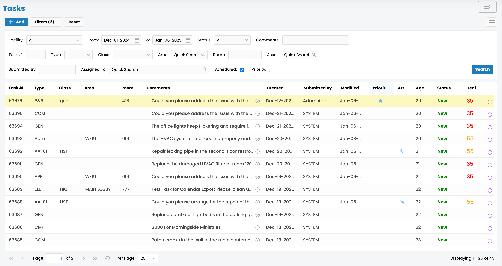

# Task

**Task Instructions:**

1. **Create a Task:** Start by clicking the "New Task" button and entering a descriptive title.
2. **Assign Responsibilities:** Use the assignee field to designate team members responsible for the task.
3. **Set Due Dates:** Specify a deadline to ensure timely completion.
4. **Add Details:** Provide a brief description and any relevant files or links necessary for completing the task.
5. **Track Progress:** Use the task status options to update progress and keep everyone informed.
6. **Review and Close:** Once completed, review the work and mark the task as closed.

<figure><figcaption></figcaption></figure>


You can also add images simply by copying and pasting them directly into the editor — and GitBook will automatically add it to your file manager.

