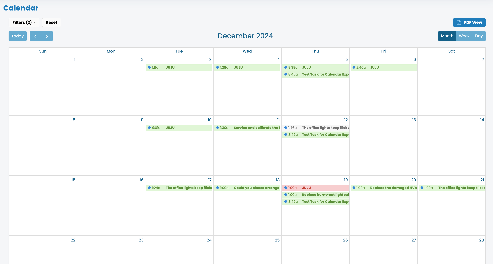

# Calendar

#### How to Use the Calendar

1. **Access the Calendar:** Navigate to the calendar section from the main menu to open it.
2. **Add Events:** Click on the "Add Event" button and fill in the necessary details such as date, time, and description.
3. **Edit Events:** Select an event from your calendar and click "Edit" to update any information about that event.
4. **Delete Events:** Choose the event you wish to remove and press the "Delete" button to remove it from your calendar.
5. **Synchronization:** Ensure your calendar is synced with other devices by enabling the sync option in settings.

By following these steps, you can effectively manage your schedule using the calendar feature.

<figure><figcaption></figcaption></figure>



Each tab is like a mini page — it can contain multiple other blocks, of any type. So you can add code blocks, images, integration blocks and more to individual tabs in the same tab block.



Add images, embedded content, code blocks, and more.

```javascript
const handleFetchEvent = async (request, context) => {
    return new Response({message: "Hello World"});
};
```



### Drawings


### Embedded content




GitBook supports thousands of embedded websites out-of-the-box, simply by pasting their links. Feel free to check out which ones[ are supported natively](https://iframely.com).


